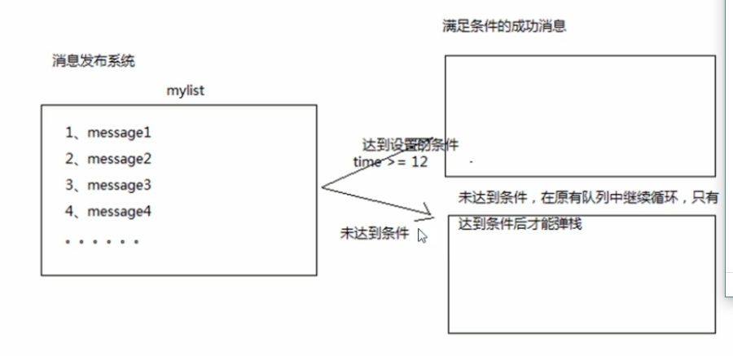

---

layout: post
title: redis
tags:
- spring
categories: redis
description: redis
---

## Redis笔记

### NoSql

not only sql   不仅仅是sql  非关系型数据库。

高并发读写

对海量数据的高效率存储和访问


mongodb也是非关系型数据库


NoSql四大分类:

- 键值对(Key-Value)存储 redis
- 列存储 hbase  查找速度快
- 文档数据库  mongdb  数据结构要求不严格
- 图形数据库  infograde 


特点

- 易拓展  数据之间没有关系
- 灵活的数据模型  不需要对存储的数据建立字段？
- 大数据量 高性能
- 高可用


### 提供多种键值数据类型。

- 字符串类型
- 列表类型
- 有序集合类型
- 散列类型
- 集合类型

### 应用场景

- 缓存
- 任务队列
- 网站访问统计
- 数据过期处理
- 应用排行榜
- 分布式集群架构中的session分离


## 安装

1. 去官网下载包，可以使用wget下载

2. 解压  tar -zxvf redis...

3. 进入解压后的文件夹，进行编译  cd后 执行  make命令

4. 再次make，安装到指定的目录：  make PREFIX=/usr/local/redis install

5. 复制一下配置文件： （从最开始make的路径复制到/usr/local/redis）  cp redis.conf /usr/local/redis\

6. 在这一步就可以启动redis

   1. 前端启动方式:直接在bin目录下执行  ./redis-server   但是窗口不能关闭 	
   2. 后端启动：先去修改conf   把daemonize 修改成yes。  然后使用命令启动： 
      1. ./bin/redis-server  ./redis.conf   启动并且使用后面指定的配置文件
      2. 查看是否启动成功：ps -ef | grep -i redis
      3. 停止redis:./redis-cli shutdown 在redis的bin目录下

7. 启动后，进入客户端模式，就是运行bin目录下的./redis-cli此时就可以进行存取数据了

8. 简单使用

   ``````java
   127.0.0.1:6379> set name imooc
   OK
   127.0.0.1:6379> get name
   "imooc"
   127.0.0.1:6379> del name
   (integer) 1
   127.0.0.1:6379> set name imooc
   OK
   127.0.0.1:6379> keys *
   1) "name"
   127.0.0.1:6379> 
   
   ``````


### jedis入门

jedis就是redis的连接的基本操作

jedis是redis官方首选的java客户端的开发包


基本使用

```java
 @Test
    public void demo1(){
        //设置ip地址和端口
        Jedis jedis = new Jedis("122.51.72.74",6376);
        //保存数据
        jedis.set("name","imooc");
        //获取数据
        System.out.println(jedis.get("name"));
        //释放资源
        jedis.close();
    }
```

#### 打开6379端口

#### - 系统没有iptables

2 Centos 7版本解决办法：
1、停止并屏蔽firewalld服务

systemctl stop firewalld
systemctl mask firewalld

2、安装iptables-services软件包

yum install iptables-services

3、在引导时启用iptables服务

systemctl enable iptables

4、启动iptables服务

systemctl start iptables

5、保存防火墙规则

service iptables save
或
/usr/libexec/iptables/iptables.init save

另外：管理iptables服务

systemctl [stop|start|restart] iptables


##### 修改/etc/systemconfig/iptables    yy复制一行 p粘贴

-A INPUT -p tcp -m state --state NEW -m tcp --dport 22 -j ACCEPT
-A INPUT -p tcp -m state --state NEW -m tcp --dport 6379 -j ACCEPT


##### 重启防火墙

service iptables restart


一直连接不上还是防火墙没有配置好。目前关闭了防火墙。关闭了redis的bind 127.0.0.1  同时将propected-mode设置成了false;


### 使用连接池

```java
 @Test
    /**
     * 连接池的方式
     */
    public void demo2(){
        //获得连接池的一个配置对象
        JedisPoolConfig config = new JedisPoolConfig();
        //设置最大的连接数
        config.setMaxTotal(30);
        //设置最大的空闲连接数
        config.setMaxIdle(10);
        //获得连接池
        JedisPool jedisPool = new JedisPool(config,"122.51.72.74",6379);
        //获取核心对象：jedis
        Jedis jedis = null;
        try {
            //获得一个连接
            jedis = jedisPool.getResource();
            //设置数据
            jedis.set("name","张三");
            System.out.println(jedis.get("name"));

        }catch (Exception e){
            e.printStackTrace();
        }finally {
            if (jedis!=null){
                jedis.close();
            }
            if (jedisPool!=null){
                jedisPool.close();
            }
        }
    }
```


### redis的数据结构

1. 字符串String  对于字符串的操作，返回的都是字符串的长度
   1. 二进制安全的，存入和获取的数据相同
   2. Value最多可容纳的长度是512M
   3. 常用命令
      1. 赋值
         - set company imooc
         - getset company baidu  //操作完后返回当前值，赋予baidu
      2. 取值
         - get company
      3. 删除
         - del comapny
      4. 数值增减
         - incr  number   如果没有number 则将number设置成0，然后自增。否则会自增。如果numebr不可以自增，则会出错
         - decr是递减
      5. 扩展
         - incrby k 199  
         - decrby k 100
         - append k   追加

2. 字符串列表list
   1. 存储list:按照插入顺序排序的链表，可以在左右中都插入。
   2. 如果键不存在，则会创建新的键，如果该键的list（链表）都没了，则会被移除
   3. ArrayList 使用数组的方式  根据索引查询速度非常快，新增和删除需要涉及到位移，所以较慢
   4.  LinkedList双向链表方式。每个元素都记录了前后元素的指针，插入删除比较快。
   5. 双向链表添加数据
   6. 双向链表删除数据
   7. 两端添加
      - lpush mylist 1 2 3  结果是321
      - rpush mylist 1 2 3
   8. 查看列表
      - lrange mylist 0 100  查看列表的元素   可以为负数（倒着数）
   9. 两端弹出
      - lpop mylist  弹出左侧第一个元素并删除
      - rpop mylist  弹出右侧第一个元素并删除
   10. 获取列表中元素个数
       - llen mylist  查看长度
   11. 拓展命令
       - lpushx mylist x   存在才会插入，不存在不会新建列表
       - rpushx mylist y
       - lrem mylist [count] [value] 删除count个value的元素，如果count<0，从右侧开始删除，如果count=0，则删除全部的
       - lset mylist 3 aaa    设置第三个坐标的元素
       - linsert mylist before aaa  bbb  在aaa之前插入bbb    before可改成after
       - rpoplpush mylist1 mylist2  将第一个的rpop 返回的给mylist2    避免会做两步出现错误。生产者消费者的问题。
       - 

3. 有序字符串集合 sorted set
   1. 字符串的集合，不允许重复。其中的每一个成员都有一个分数（权重）用来排序
   2.  游戏排名、微博热点话题？？？？
   3. 添加元素
      - zadd mysort 70 zs 80 ls 90 ww   如果已经存在，则会替换掉分数
   4. 获得元素
      - zscore mysort zs   获取某一个成员的分数
      - zcard mysort 获取数量
   5. 删除元素
      - zrem mysort zs ww 
   6. 范围查询
      - zrange mysort 0 -1 withscores 由小到大
      - zreverange mysort 0 -1 withscores 由大到小
      - zremrangebyrank mysort 0 4  根据范围删除[排名]
      - zremrangebyscore mysort 10 20  根据分数删除
   7. 扩展命令
      - 返回分数在某个区间的成员并按照分数由低到高排序： zrangebyscore mysort 0 100 withscores limit 0 2
      - zincrby mysort 3 ls  给李四加三分
      - zcount mysort 80 90  80到90分之间的有几个
   8. 场景
      - 在线积分排行榜
      - 

4. 哈希 hash
   1. String key和String Value的map容器
   2. 每一个hash可以存储非常多的键值对
   3. 赋值
      - hset hash1 username jack  其中的hash1和hash2可以说是类似于命名空间或hash的名字
      - hset hash2 userhame wsr
      - hmset hash1 username jack age 1   可以赋值多个键值对
   4. 取值
      - hget hash1 username  获取哪一个哈希的哪一个键值对
      - hmget myhash username age
      - hgetall  获取所有的键值对
   5. 删除
      - hdel hash1 username age  删除哪个键值对
      - del hash1 删除整个hash
   6. 增加数字
      - hincrby hash1 age 5
      - hdecrby hash1 age 5
   7. 自学命令
      - hexists hash1 username     ->  1
      - hexists hash1 password      ->  0
      - hlen myhash  hash的长度
      - hkeys myhash  获取所有的key
      - hvalues myhash 获取所有的value

5. 字符串集合set
   1. 没有排序的字符集合
   2. 不允许出现重复元素
   3. 添加/删除元素
      - sadd myset a b c  添加元素
      - srem myset a b     删除元素
   4. 获得集合中的元素
      - smembers myset  获取元素的值
      - sismember myset a 判断是否存在->0  1
   5. 集合差集运算
      - 返回集合中两个相差的成员
      - sdiff mya1 mya2  
   6. 交集运算
      - sinter mya1 mya2
   7. 并集运算
      - sunion mya1 mya2  合并到一起
   8. 扩展命令
      - 获取成员数量  scard myset
      - 随机返回set中一个成员  srandmember myset 
      - 两个集合相差的成员存储到另外一个集合上：sdiffstore mynew mya1 mya2
      - sinterstore mynew mya1 mya2 求交集并存起来 
      - sunionstore mynew mya1 mya2 求并集并存起来
   9. 使用场景
      - 唯一性的数据
      - 跟踪访问某一博客的ip地址。。。。。
      - 所有购买某一个设备的id存储在一个set中，求两种商品同时购买的


#### Key定义的注意点

不要过长 不要太短，统一的命名规范。


## redis keys的通用操作

1. 获得所有的keys   keys *
2. my开头   keys my?
3. 删除key  del my1 my2 my3
4. exists my1  是否存在 返回1 0
5. 获取  get my1  
6. 重命名： rename my1 newname
7. 设置过期时间（秒）  expire newname 1000
8. ttl所剩超时时间 ttl newname   如果没有设置返回-1
9. type newname  获取类型


### Redis特性

1. 多数据库

   - 客户端连接的时候可以指定连接哪个数据库
   - 最多可位数16个数据库，默认连接第0个数据库。   0-15
   - move myset 1  将myset这个移到1号库中

2. 事务

   - 事务中所有命令串行化顺序执行。执行期间不会为其他的客户端提供支持。命令执行失败了，后面的还会被执行。

   - multi    ：开启事务，在之后执行的都会认为是事务内的 transtion
   - exec      ：提交commit
   - discard ：回滚rollback


### 持久化

数据都是存储在内存中的，为了保证数据不丢失，则需要将数据从文件中读取出来

- RDB方式

  - 默认支持，不需要配置在指定的时间间隔内，将数据库快照保存到内存中
  - 优势：整个redis只包含一个文件。易于灾难恢复  性能最大化
  - 劣势：保证数据的高可用性，则不是一个很好的选择  还没来得及写入快照，数据就丢失了
  - 配置：redis.conf 中，寻找到  
    - save 900 1   每900秒中，如果有一个key发生变化，则产生一个快照
    - save 300 10  没300秒中有10个k
    - save 60 10000 每60秒 10000个key
    - dbfilename  dump.rdb  数据文件名

- AOP方式

  - 日志的形式记录服务器每一个操作。重启后会读取日志构建数据库
  - 优势：
    - 更高的数据安全性。每秒同步，每修改同步，不同步
    - 日志采用append模式。写入时出事故也不会影响
    - 日志过大可自动启动重写模式
    - 日志记录所有的修改
  - 劣势：
    - 文件要大
    - 运行效率低

  

  

  